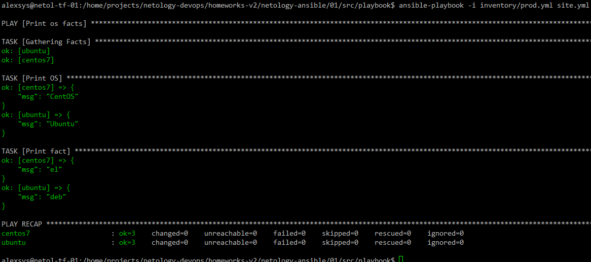
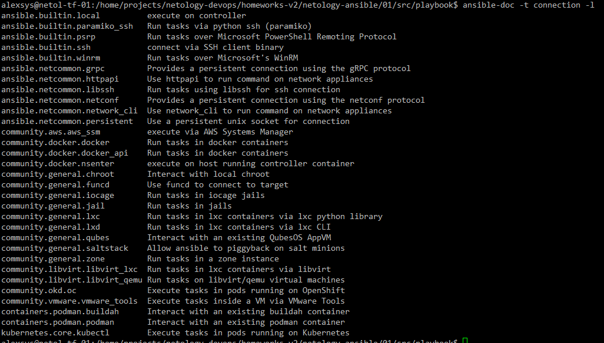

# 01.  Введение в Ansible
Работаем в ВМ Debian 12, версии Ansible и Docker:


## Задание 1
1. Выполняем Playbook. Полоучили значение *12*:


2. Данное значение задон в файле `group_vars/all/examp.yml`. Меняем на *all default fact* и выполняем снова:


Изменилось.

3. Создаём [compose-file](src/compose.yaml) и запускаем два контейнера с CentOS7 и Ubuntu 22.04 c , предварительно установленным python


4. Выполняем playbook с окружением prod:



5,6. Поменяли значения в `src/deb/examp.yml` `src/el/examp.yml`:


7. Зашифровали факты с помощью `ansible-vault`:


Результат:


8. Выполняем playbook. Просто так не работает, нужно указать ключ, чтобы спросили пароль:


9. Смотрим список коннекторов:



Очевидно, нам нужен `ansible.builtin.local`.

10. Добавили localhost в окружение prod:
```yaml
---
  el:
    hosts:
      centos7:
        ansible_connection: docker
  deb:
    hosts:
      ubuntu:
        ansible_connection: docker
  local:
    hosts:
      localhost:
        ansible_connection: local
```
11. Выполняем:


## Задание 2
1. Расшифровываем файлы:


2. Шифруем строку:


3. Выполняем:


4. Добавляем в окружение контейнер с fedora:
```yaml
fedora:
    container_name: 'fedora'
    stdin_open: true
    tty: true
    image: pycontribs/fedora:latest
    command: bash
```
Запускаем:


Добавляем группу хостов fed и переменную some_fact. Выполняем playbook:


5. Создаём [скрипт](src/run.sh) для запуска и выполняем:

