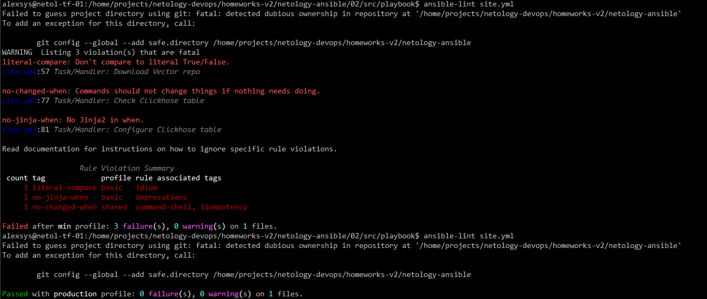
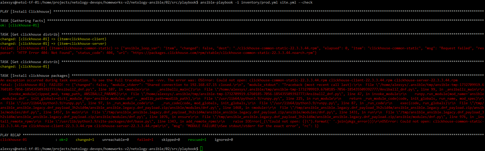
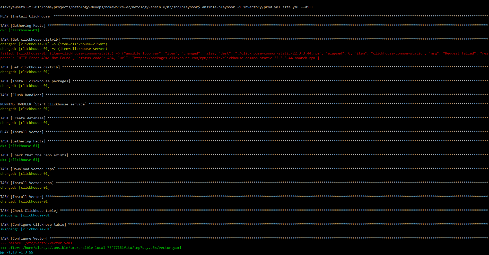
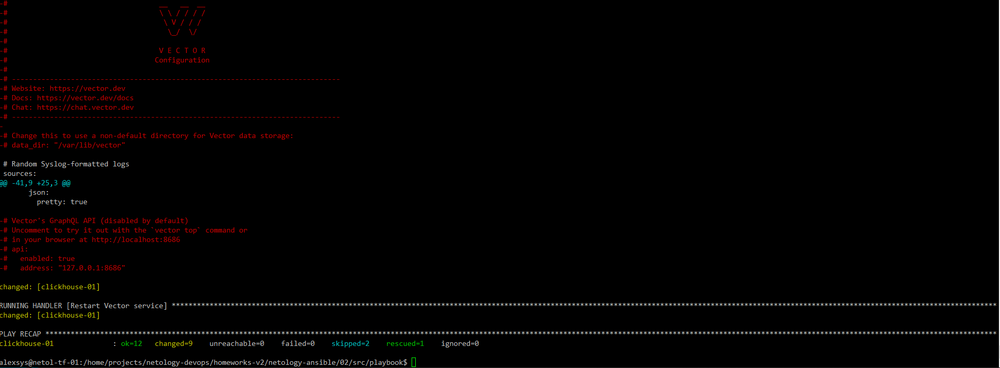
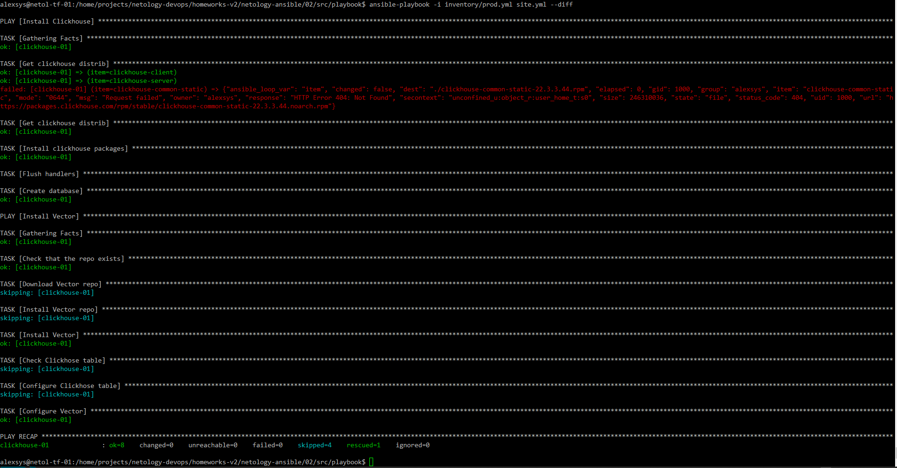
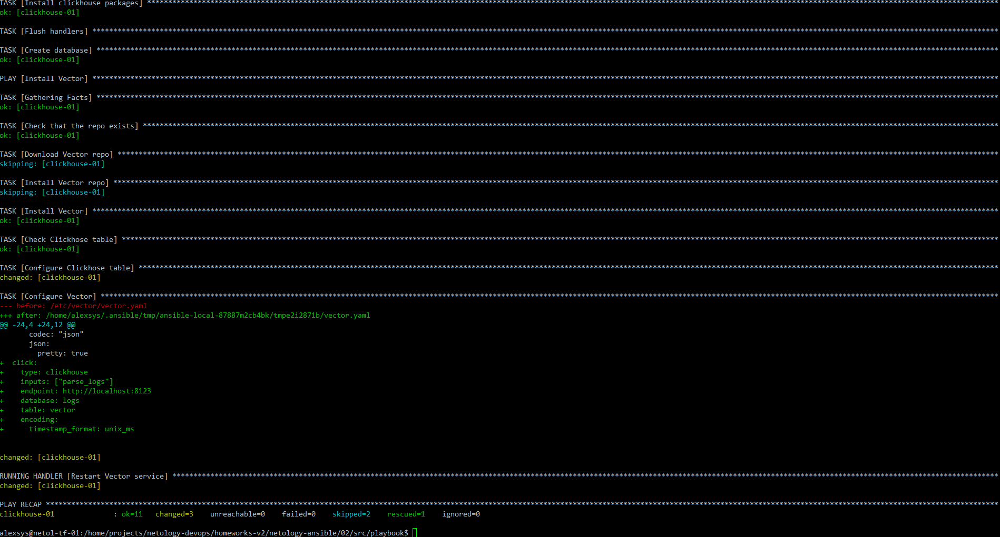
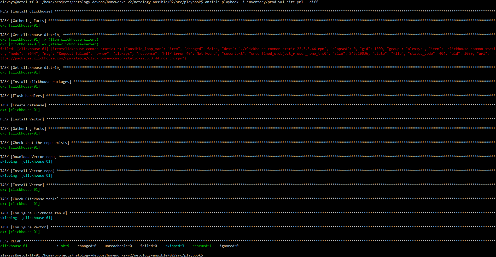
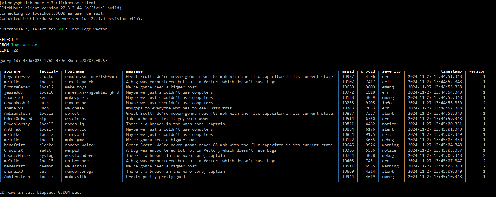

# Работа с Playbook

## Создание playbook для установки Clickhouse и Vector.
Создаём модуль, осуществляющий установку Clickhouse и Vector в RHEL-совместимой ОС.

Переменные:
- clickhouse_version - версия ClickHouse, которую необходимо установить
- clickhouse_packages - список пакетов ClickHouse для установки
- vector_version - версия Vektor, которую необходимо установить
- vector_curl - Адрес для скачивания скрипта установки репозитория Vector
- vector_configure_click_sink - Флаг конфигурирования тестового sink. Если true, создаёт в ClickHouse таблицу и 
конфигурирует в Vektor соответствующий сток.  
- vector_click_host - хост clickhouse
- vector_click_db - имя БД
- vector_click_table - имя таблицы
- vector_table_sql - текст SQL-запроса с описанием колонок и настроек таблицы.

Проверка ansible lint, исправление ошибок и повторная проверка: 

Запуск с флагом `--check` падает на этапе установки пакетов, т.к. не может найти скачанные файлы:

Запускаем выполнение: 

Повторный запуск:

Меняем флаг конфигурирования таблицы:

Проверка:

 