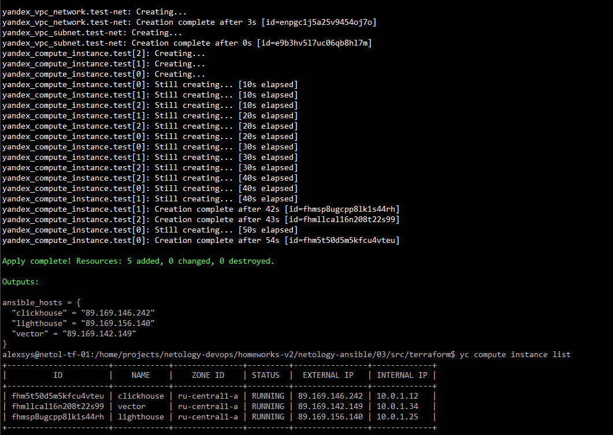
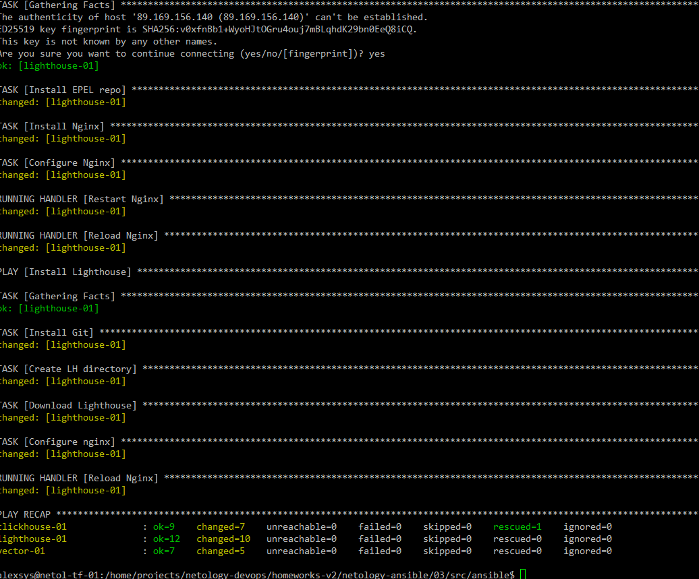
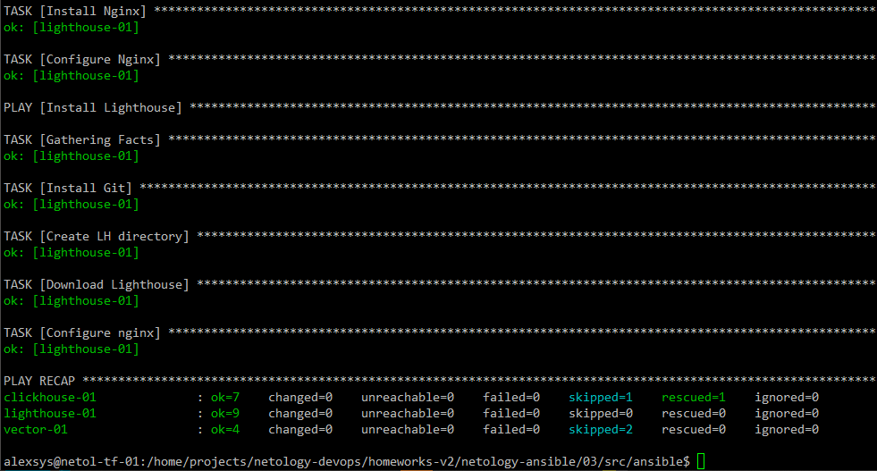
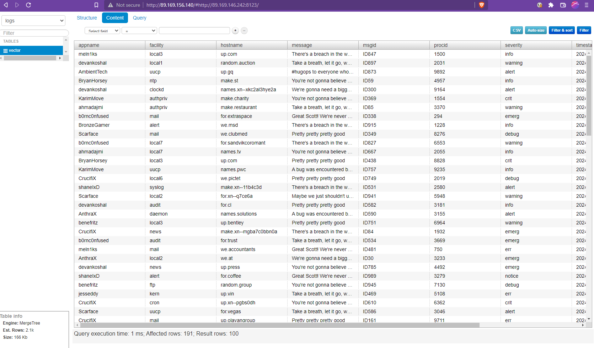

# 03. Использование Ansible

## Разворачиваем стек в Yandex Cloud
1. подготовим стенд из 3 ВМ с помощью terraform.

2. Данный сценарий осуществляет установку и настройку ClickHouse, Vector и Lighthouse
на три группы хостов с RHEL-совместимой ОС.
 
Хосты в инвентаре разделены на 3 группы: clickhouse, vector, lighthouse
Соответственно разделены переменные:

Для Clickhouse 
- clickhouse_version - версия ClickHouse, которую необходимо установить
- clickhouse_packages - список пакетов ClickHouse для установки
- clickhouse_server_config - путь конфигурационному файлу сервера

Для Vector
- vector_version - версия Vektor, которую необходимо установить
- vector_curl - Адрес для скачивания скрипта установки репозитория Vector 

Для Lighthouse
- lighthouse_url - Адрес репозитория Lighthouse
- lighthouse_dst_dir - каталог для установки

Общие для Clickhouse и Lighthouse переменные в группе all
- vector_configure_click_sink - Флаг конфигурирования тестового sink. Если true, создаёт в ClickHouse таблицу и 
конфигурирует в Vector соответствующий сток.  
- vector_click_host - хост clickhouse
- vector_click_db - имя БД
- vector_click_table - имя таблицы
- vector_table_sql - текст SQL-запроса с описанием колонок и настроек таблицы.
 
Также в группе all в файле `tf_ansible_vars.yml` размещены переменные с адресами хостов, полученными при разворачивании стенда.

Сценарий устанавливает нужное ПО на хосты соответствующей группы. Кроме того, на группу 
lighthouse дополнительно устанавливается и настраивается nginx.

Зависимости:
- community.general.xml
- пакет lxml на управляемых хостах (устанавливается автоматически).

Выполнение:

2-й запуск:

Интерфейс Lighthouse:

