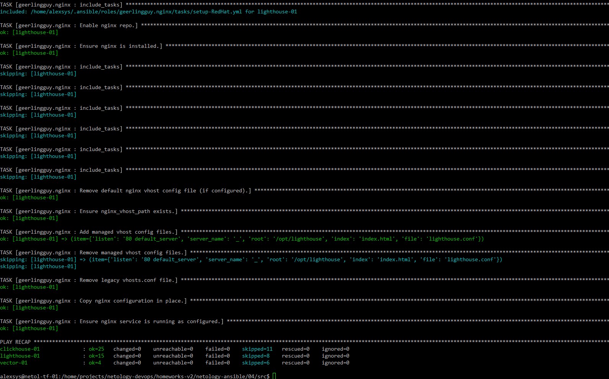
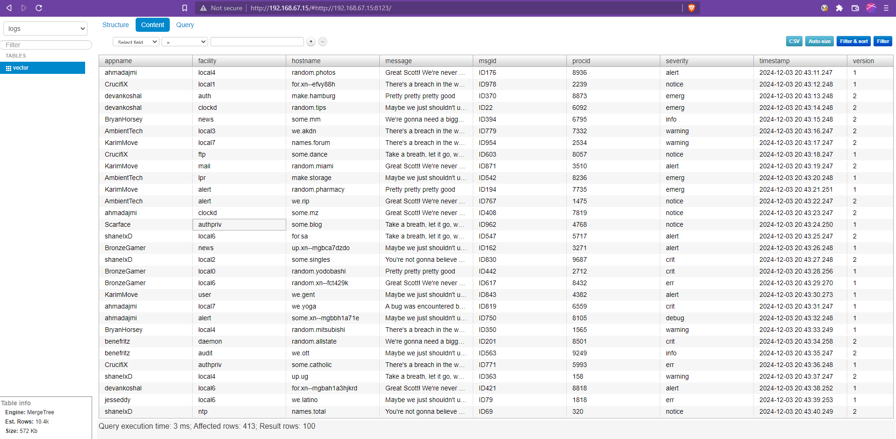

# 04. Работа с roles

Данный сценарий осуществляет установку и настройку ClickHouse, Vector и Lighthouse
на три группы хостов с ОС семейства RHEL или Debian.

Установка каждого продукта производится при помощи отдельной роли 
Хосты в инвентаре разделены на 3 группы: clickhouse, vector, lighthouse
Переменные:
Для Clickhouse 
- clickhouse_version - версия ClickHouse, которую необходимо установить
Для Vector
- vector_version - версия Vector, которую необходимо установить
Для Lighthouse
- lighthouse_dst_dir - каталог для установки

Общие для Clickhouse и Lighthouse переменные в группе all
- vector_configure_click_sink - Флаг конфигурирования тестового sink. Если true, создаёт в ClickHouse таблицу и 
конфигурирует в Vector соответствующий сток.  
- vector_click_host - хост clickhouse
- vector_click_db - имя БД
- vector_click_table - имя таблицы
- vector_table_sql - текст SQL-запроса с описанием колонок и настроек таблицы.
 
Также в группе all в файле `tf_ansible_vars.yml` размещены переменные с адресами хостов, полученными при разворачивании стенда.

Сценарий устанавливает нужное ПО на хосты соответствующей группы. Кроме того, на группу 
lighthouse дополнительно устанавливается и настраивается nginx.

Зависимости:
- geerlingguy.nginx
- git@github.com:AlexeySetevoi/ansible-clickhouse.git
- [https://github.com/Alex-AVS/lighthouse-role](https://github.com/Alex-AVS/lighthouse-role)
- [https://github.com/Alex-AVS/vector-role](https://github.com/Alex-AVS/vector-role)

Пример исполнения в тестовом окружении `test.yml` на одном хосте:

Интерфейс Lighthouse:

